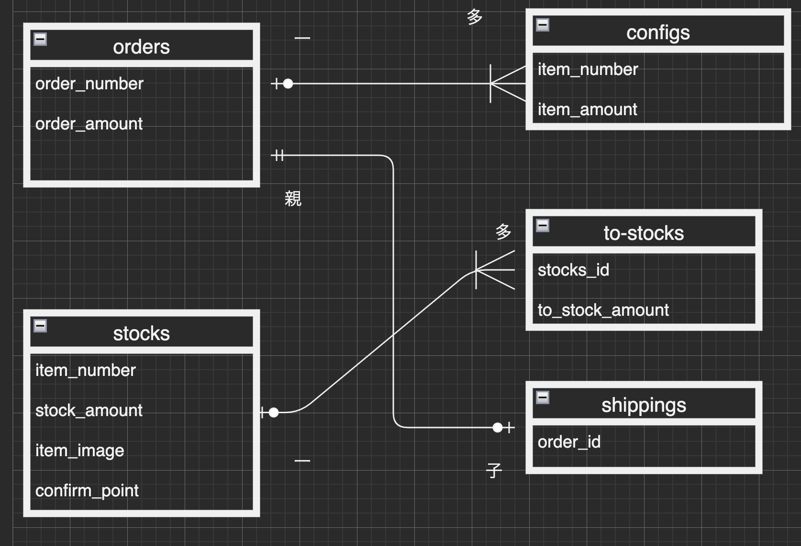

# README

This README would normally document whatever steps are necessary to get the
application up and running.

Things you may want to cover:

* Ruby version

* System dependencies

* Configuration

* Database creation

* Database initialization

* How to run the test suite

* Services (job queues, cache servers, search engines, etc.)

* Deployment instructions

* ...

## アプリケーション名 
---
syukka 
 
## アプリケーション概要 
---
出荷品が画像でわかる様な簡単な出荷指示アプリを作成しました。  

## URL 
---
https://syukka.onrender.com
 
 
 
## 利用方法 
---
### 出荷指示機能 
---
*商品名（３種類）と数量を入力フォームに入力します。(①pod-r,②pod-l,③pods） 
*注文ボタンを押すと在庫管理ページに遷移し注文受け入れボタンを押して注文確定  
*出荷指示ボタンを押すと出荷指示ページへ遷移します。 
*注文した商品のリンクを押すと出荷品が画像で表示されます。 
### 入庫機能 
---
*在庫管理ページで入庫処理ボタンを押すと入庫フォームが現れます。 
*商品名（３種類）と数量を入力フォームに入力後入庫確認ボタンを押します。 
*在庫数量が更新されます。
 
 
 ### アプリケーションを作成した背景 
 ---
 倉庫作業業務を担当していた時に思った工数削減案
 
 
## 洗い出した要件 
---
https://docs.google.com/spreadsheets/d/1_ILAm7MFxtd3L0V1_S75sjZNSBLFFL6vPYoe7E_yuUY/edit?usp=sharing
 
 
## データベース設計 
---

 
 
 
## 開発環境 
---
 
*フロントエンド 
*バックエンド 
*インフラ 
*テキストエディタ 
 

## ローカル環境での動作 
---
 
% git clone https://github.com/HEROHEROPA/syukka.git 
% cd syukka.git 
% bundle install 
% yarn install 

 
 

## orders テーブル

｜Column                | Type     |  Options                 |  
｜----------------------| -------  |  ----------------------  |   
｜order_number          | string   |  null: false             |         
｜order_amount          | integer  |  null: false             |  

### Association

- has_one :shipping

## stocks テーブル

｜Column                | Type          |  Options                          |  
｜----------------------| ------------  |  -----------------------------    |  
｜item_number           | string        |  null: false                      |  
｜stock_amount          | integer       |  null: false                      |  
｜item_image            | text          |  null: false                      |  
｜confirm_point         | text          |                                   |  

### Association
- has_many :to_stocks

## shippings テーブル

｜Column                | Type          |  Options                          |  
｜----------------------| ------------  |  -------------------------------- |  
｜order                 | references    |  null: false ,foreign_key: true   |  
｜config_id             | integer       |  null: false                      |  

### Association

- belongs_to :order

## to_stocks テーブル

｜Column                | Type          |  Options                          |  
｜----------------------| ------------  |  -------------------------------- |  
｜stock                 | references    |  null: false ,foreign_key: true   |  
｜to_stock_amount       | integer       |  null: false                      |  

### Association

-belongs_to :stock

 

## アプリケーション概要  
出荷品が画像でわかる様な簡単な出荷指示アプリを作成しました。  
● 接続先情報  
■ https://syukka.onrender.com 
● Githubリポジトリ  
■ https://github.com/HEROHEROPA/syukka  
● 開発環境  
○ Ruby/Ruby on Rails/MySQL/Github/Visual Studio Code/JavaScript  
● 開発期間と平均作業時間  
○ 開発期間：5/25〜7/14現在(実働12日間)  
○ 1日あたりの平均作業時間：6時間 
○ 合計：72時間  
